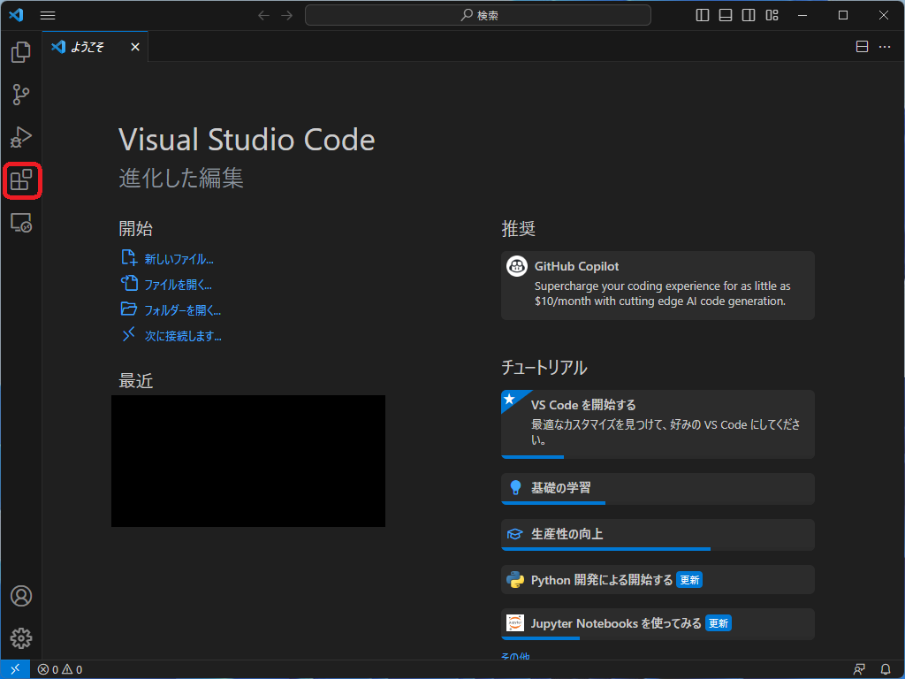
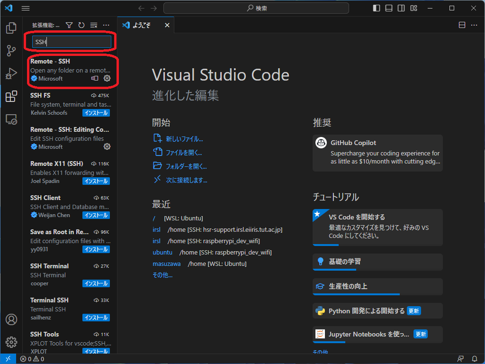
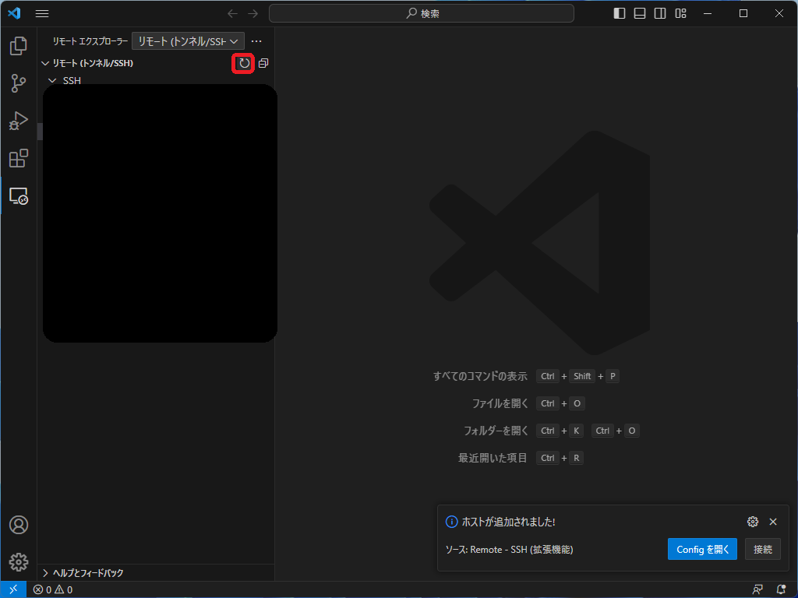
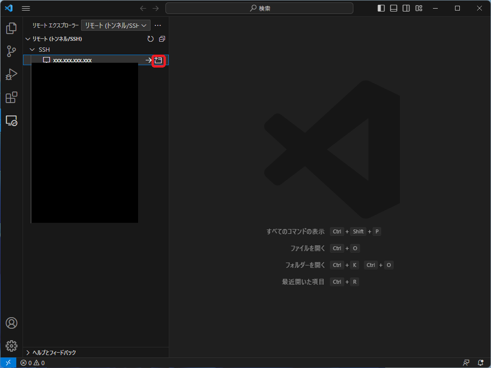

# Tips 
## VScodeを使ったRaspberry piへの接続
### VSCodeのインストール
以下手順にて実施する．
1. VSCodeのインストール
    - Windowsの場合，Windows Storeを開き`Visual studio code`で検索すると，該当ソフトが出てくるので，それをインストールする．
    
1.  SSH用の拡張機能をインストールする．
    - VSCodeを実行し拡張機能（下図中の赤枠部分）をクリックする．
    
    - 検索バーで`SSH`と検索し，`Remote - SSH`を選択しインストールする．
    
1. リモート機能の設定
    1. リモート（下図中の赤枠部分）をクリックする．
    
    1. プルダウンメニューで`リモート(トンネル/SSH)`を選択する．
    
    1. SSHの文字の右側にある`+`のキーを押す．
    
    1. コマンドとして`ssh irsl@xxx.xxx.xxx.xxx`と入れる．（`xxx.xxx.xxx.xxx`には自分の接続したいコンピュータのIPアドレスを入れる．） 
    
    1. どの設定に加えるか出てくるが，ここでは一番上を選ぶ．
    
    1. アップデートを行うと設定が追加される．
    
### 接続方法
1. リモート（下図中の赤枠部分）をクリックする．
    
1. プルダウンメニューで`リモート(トンネル/SSH)`を選択する．
    
1. 接続したいコンピュータのところの右側にある新しいウィンドウで接続をクリックする．
    
### ターミナルの開き方
- 接続後`Ctrl + @`でターミナルが開く．
### ファイルアップロード
- 接続後に手元PCファイルをVSCodeの エクスプローラーへドラックアンドドロップすることでできる．(Jupyterからのファイルは直接アップロードできないので，一度手元のPCにダウンロードしてからアップロードすること．)
